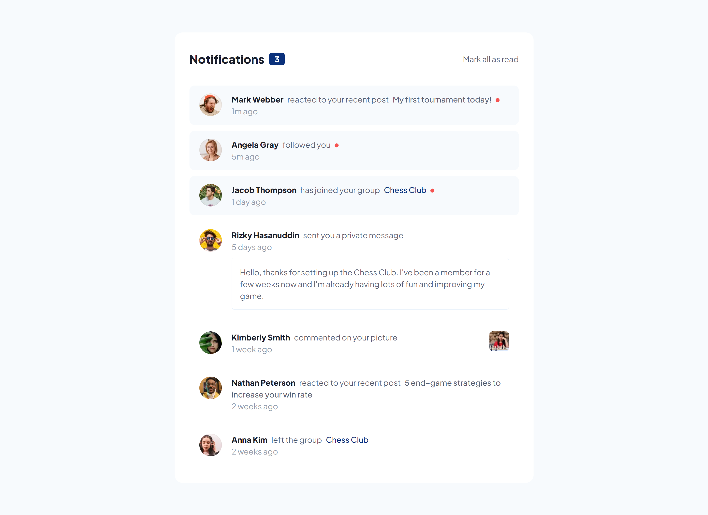
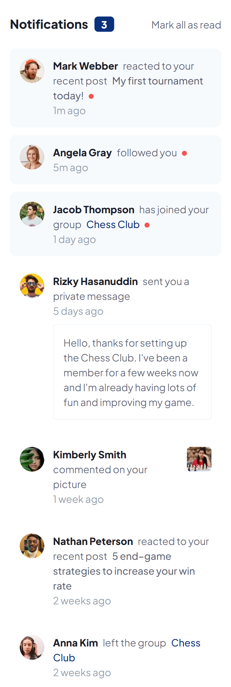

# Frontend Mentor - Notifications page solution

This is a solution to the [Notifications page challenge on Frontend Mentor](https://www.frontendmentor.io/challenges/notifications-page-DqK5QAmKbC). Frontend Mentor challenges help you improve your coding skills by building realistic projects. 

## Table of contents

- [Overview](#overview)
  - [The challenge](#the-challenge)
  - [Screenshot](#screenshot)
  - [Links](#links)
- [My process](#my-process)
  - [Built with](#built-with)
  - [What I learned](#what-i-learned)
- [Author](#author)

## Overview

### The challenge

Users should be able to:

- Distinguish between "unread" and "read" notifications
- Select "Mark all as read" to toggle the visual state of the unread notifications and set the number of unread messages to zero
- View the optimal layout for the interface depending on their device's screen size
- See hover and focus states for all interactive elements on the page

### Screenshot

### Links

- Solution URL: (https://github.com/arbaiv/notification-page-challenge)
- Live Site URL: (https://astonishing-duckanoo-1f3b98.netlify.app/)

## My process

### Built with

- Semantic HTML5 markup
- CSS custom properties
- Flexbox
- CSS Grid
- Mobile-first workflow
- JavaScript

### What I learned

I was able to learn and practice arrow function through this project. 

### Continued development

I thought that I could learn to create read & unread functionality through this project and learn some advanced JS concepts, but this project wasn't that challenging. So, I would be taking on some more challenging projects to keep working on my JS.

## Author

- LinkedIn - [Abdur Rahaman](https://www.linkedin.com/in/abdur-rahaman-arb4/)
- Github - [@arbaiv](https://github.com/arbaiv)
- Twitter - [@arbaiv](https://twitter.com/arbaiv)
- Frontend Mentor - [@arbaiv](https://www.frontendmentor.io/profile/arbaiv)